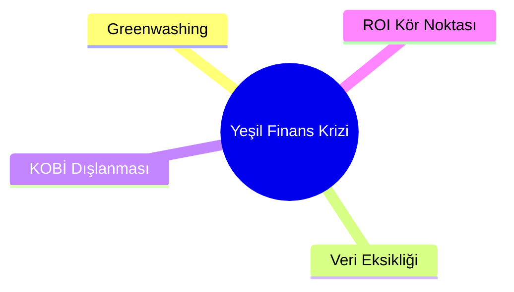
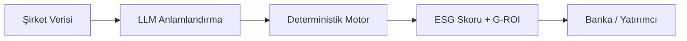
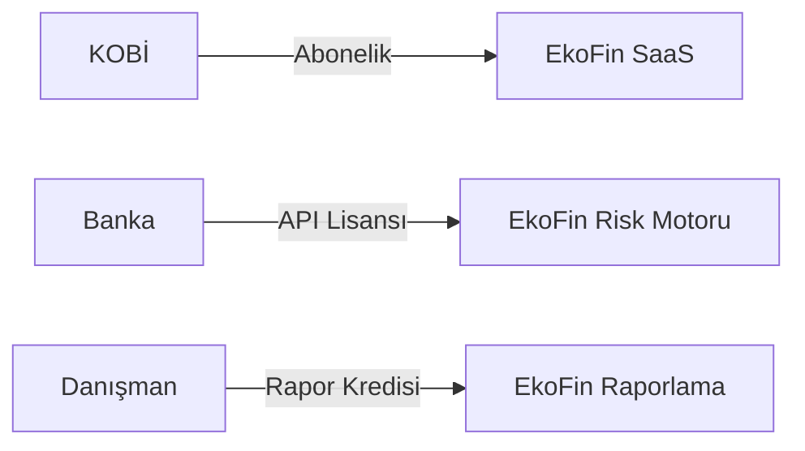
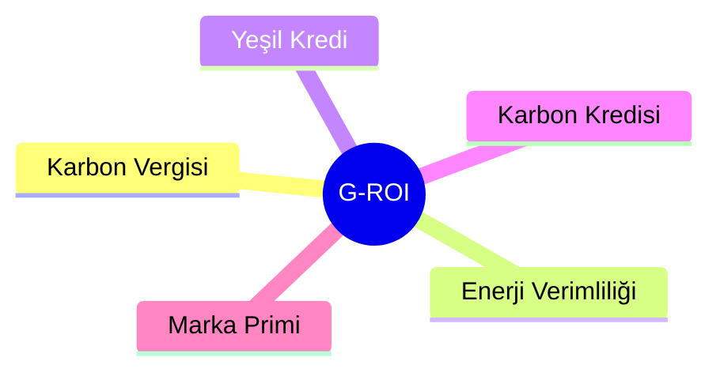

# EkoFin — TEKNOFEST Finansal Teknolojiler Yarışması Sunum Rehberi

> Bu rehber, `sunum/` klasöründeki kaynaklardan (`esg_sunum_raporu.md`, `ihityaçlar.md`, `problem.txt`, `g-roi.txt`, `tam-sam-som.md`) ve `FINANSAL_TEKNOLOJILER_YARISMASI_PROJE_SUNUMU_2026_cYpZz(1).pptx` şablonundan türetilmiştir.
>
> Her slide için **ana mesaj**, **içerik önerileri** ve **4 farklı üretim alternatifi** sunulmaktadır:
> 1. `pptx-from-layouts` — PowerPoint (assertion-evidence outline)
> 2. `marp-slides` — Markdown → PDF/PPTX/HTML
> 3. `slidev-agent-skill` — Geliştirici dostu interaktif HTML
> 4. `visual-explainer` — Görsel açıklama / diyagram önerisi

---

## Genel Strateji

**Sunum Türü:** Yatırım / Yarışma pitch deck  
**Süre:** 10–12 dk (12 slide)  
**Hedef Kitle:** Yarışma jürisi (finans, teknoloji, girişimcilik profilleri)  
**Ana Mesaj:** *EkoFin, üretken yapay zeka ve deterministik finans motoruyla yeşil dönüşümü KOBİ'ler için kârlı, bankalar için güvenilir ve yatırımcılar için kanıtlanabilir hale getirir.*

**Tasarım İlkeleri**
- Her slaytte tek bir fikir.
- Başlıklar tam cümle (assertion) olmalı.
- Veriler görselleştirilmeli; tablo ve metin duvarından kaçınılmalı.
- Renkler: Yeşil (#10B981), koyu yeşil (#064E3B), finans mavisi (#1E3A8A), nötr gri (#F3F4F6).
- Tek tip font: Başlıklar için Inter/Satoshi bold, gövde için Inter regular.

---

# Slide 1: Kapak

**Puan:** Şablona uygunluk / düzen  
**Ana Mesaj:** Proje adı ve takım bilgileri net, profesyonel ve hatırlanabilir.

**İçerik**
- Proje Adı: **EkoFin**
- Konu Başlığı: Yeşil Finansman ve ESG Raporlama için Üretken Yapay Zeka Platformu
- Takım Adı / ID / Başvuru ID
- Tek cümlelik tagline: *"Yeşil dönüşümü KOBİ'ler için kârlı hale getiren finansal teknoloji."*

**Alternatif 1 — pptx-from-layouts**
```markdown
# Slide 1: EkoFin
**Visual: hero-statement**

Yeşil Finansman ve ESG Raporlama için Üretken Yapay Zeka Platformu

*[Takım Adı] · [Takım ID] · [Başvuru ID]*
```

**Alternatif 2 — marp-slides**
```markdown
---
marp: true
theme: default
class: invert
---

# EkoFin
## Yeşil Finansman ve ESG Raporlama için Üretken Yapay Zeka Platformu

**[Takım Adı]** · Takım ID: `000` · Başvuru ID: `000`


```

**Alternatif 3 — slidev-agent-skill**
```markdown
---
layout: cover
background: "linear-gradient(to right, #064E3B, #10B981)"
class: text-white text-center
---

# EkoFin

## Yeşil Finansman ve ESG Raporlama için Üretken Yapay Zeka Platformu

**[Takım Adı]** · Takım ID · Başvuru ID
```

**Alternatif 4 — visual-explainer**
> **Prompt:** "Modern fintech startup cover slide, dark green gradient background, white sans-serif typography, abstract leaf-coin hybrid icon, premium minimalist style, 16:9 presentation aspect ratio"

---

# Slide 2: İçindekiler / Yol Haritası

**Puan:** Şablona uygunluk / düzen  
**Ana Mesaj:** Sunumun yapısı 8 ana başlıkta net şekilde özetleniyor.

**İçerik**
1. Problem
2. Çözüm
3. Kullanılacak Yöntem
4. Rakip Analizi
5. Pazar
6. İş Modeli
7. Risk Analizi
8. Proje Takvimi

**Alternatif 1 — pptx-from-layouts**
```markdown
# Slide 2: 8 Adımda EkoFin
**Visual: process-8-phase**

1. Problem
2. Çözüm
3. Yöntem
4. Rakipler
5. Pazar
6. İş Modeli
7. Risk
8. Takvim
```

**Alternatif 2 — marp-slides**
```markdown
---

# Sunum Akışı

| # | Bölüm | Süre |
|---|-------|------|
| 1 | Problem | 1 dk |
| 2 | Çözüm | 2 dk |
| 3 | Yöntem | 2 dk |
| 4 | Rakip Analizi | 1 dk |
| 5 | Pazar | 1.5 dk |
| 6 | İş Modeli | 1.5 dk |
| 7 | Risk Analizi | 1 dk |
| 8 | Proje Takvimi | 1 dk |
```

**Alternatif 3 — slidev-agent-skill**
```markdown
---
layout: center
class: text-center
---

# 8 Bölümde EkoFin

<v-clicks>

- Problem → Çözüm → Yöntem
- Rakip Analizi → Pazar
- İş Modeli → Risk → Takvim

</v-clicks>
```

**Alternatif 4 — visual-explainer**
> **Prompt:** "Horizontal timeline with 8 connected circles, numbered 1 to 8, dark green accent on active first node, clean corporate infographic style, labels: Problem, Solution, Method, Competition, Market, Business Model, Risk, Timeline"

---

# Slide 3: Teşekkürler / Slogan Slaydı

**Puan:** Slogan / kapanış hissi  
**Ana Mesaj:** Projenin temel vaadi sloganla pekiştiriliyor.

**İçerik**
- Slogan: *"Yeşil dönüşüm artık bir maliyet değil, rekabet avantajı."*
- Veya: *"Şeffaf veri, doğru sermaye, gerçek sürdürülebilirlik."*

**Not:** Şablonda bu slide "slogan" olarak geçiyor; sunumun sonunda da tekrar kullanılabilir. Burada kapanış için hazır tutulmalı.

**Alternatif 1 — pptx-from-layouts**
```markdown
# Slide 3: Teşekkürler
**Visual: quote-hero**

"Yeşil dönüşüm artık bir maliyet değil, rekabet avantajı."

— EkoFin
```

**Alternatif 2 — marp-slides**
```markdown
---
class: invert text-center
---

# Teşekkürler

## *"Yeşil dönüşüm artık bir maliyet değil, rekabet avantajı."*

**[Takım Adı]** · ekofin@example.com
```

**Alternatif 3 — slidev-agent-skill**
```markdown
---
layout: end
class: text-center text-white
background: "#064E3B"
---

# Teşekkürler

## *"Şeffaf veri, doğru sermaye, gerçek sürdürülebilirlik."*

[email@example.com](mailto:email@example.com)
```

**Alternatif 4 — visual-explainer**
> **Prompt:** "Inspirational closing slide, dark green background, large white italic quote 'Yeşil dönüşüm artık bir maliyet değil, rekabet avantajı', subtle leaf pattern, premium corporate style"

---

# Slide 4: Sunum Düzeni Kuralları

**Puan:** Şablona uygunluk / düzen  
**Ana Mesaj:** Yarışma değerlendirme kriterlerine göre sunum planlandı.

**İçerik**
- 12 slide, 8 ana başlık.
- Her kriterin puan ağırlığına göre zaman ve görsel bütçesi ayrıldı.
- Teknoloji ve yöntem (20 puan) en detaylı bölüm.

**Alternatif 1 — pptx-from-layouts**
```markdown
# Slide 4: Değerlendirme Kriterlerine Göre Sunum Planı
**Visual: table**

| Bölüm | Puan | Odak |
|-------|-----:|------|
| Problem | 5 | Kanıtlanmış aciliyet |
| Çözüm | 15 | Net vaat ve toplumsal fayda |
| Yöntem | 20 | Teknoloji ve bilimsel temel |
| Rakip Analizi | 10 | Farklılaşma |
| Pazar | 10 | TAM/SAM/SOM |
| İş Modeli | 15 | Ticarileşme ve gelir |
| Risk Analizi | 10 | Gerçekçi önlemler |
| Takvim | 5 | Yol haritası |
```

**Alternatif 2 — marp-slides**
```markdown
---

# Sunum Planı

| Kriter | Ağırlık | Slide'lar |
|--------|--------:|-----------|
| Problem | 5 | 5 |
| Çözüm | 15 | 6 |
| Yöntem | 20 | 7 |
| Rakip Analizi | 10 | 8 |
| Pazar | 10 | 9 |
| İş Modeli | 15 | 10 |
| Risk Analizi | 10 | 11 |
| Takvim | 5 | 12 |
```

**Alternatif 3 — slidev-agent-skill**
```markdown
---
layout: two-cols
---

# Değerlendirme Kriterleri

- Problem (5p)
- Çözüm (15p)
- Yöntem (20p)
- Rakip Analizi (10p)

::right::

# Sunum Planımız

- Pazar (10p)
- İş Modeli (15p)
- Risk Analizi (10p)
- Takvim (5p)

> Toplam: 90 puanlık içeriği karşılıyoruz.
```

**Alternatif 4 — visual-explainer**
> **Prompt:** "Pie chart showing evaluation criteria weights: Method 22%, Solution 17%, Business Model 17%, Risk 11%, Competitors 11%, Market 11%, Problem 6%, Timeline 6%, corporate green and blue color scheme"

---

# Slide 5: Problem (0–5 Puan)

**Puan:** 5  
**Ana Mesaj:** KOBİ'ler ve finans kurumları için yeşil dönüşüm verisi pahalı, statik ve güvenilmez.

**İçerik**
- **Greenwashing:** Şirketler ürünlerini olduğundan çevre dostu gösteriyor. Yatırımcıların %85'i greenwashing'in ciddi bir problem olduğunu söylüyor.
- **Veri Eksikliği / Kalitesi:** Yatırımcıların %47'si ESG veri eksikliğini, %41'i veri kalitesini en büyük zorluk olarak görüyor.
- **KOBİ'ler Dışarıda:** Raporlama süreçleri pahalı ve statik; KOBİ'ler finansmana erişemiyor.
- **ROI Çıkmazı:** Geleneksel ROI hesaplamalarında karbon salınımının kredi riski ve finansal getirisi modellenmiyor.

**Alternatif 1 — pptx-from-layouts**
```markdown
# Slide 5: Yeşil Dönüşüm Verisi Pahalı, Statik ve Güvenilmez
**Visual: cards-4**

[Card 1: Greenwashing]
%85 yatırımcı greenwashing'i ciddi risk görüyor.

[Card 2: Veri Kalitesi]
%47 ESG veri eksikliği, %41 veri kalitesi sorunu.

[Card 3: KOBİ Dışlanması]
Raporlama maliyeti yüksek → KOBİ'ler finansmana erişemiyor.

[Card 4: ROI Kör Noktası]
Karbonın kredi riski ve getirisi geleneksel ROI'de yok.
```

**Alternatif 2 — marp-slides**
```markdown
---

# Problem: Yeşil Finans Ekosisteminin 4 Krizi

<div class="grid">

<div>

### 🌫️ Greenwashing
%85 yatırımcı ciddi problem olarak görüyor.

</div>

<div>

### 📉 Veri Eksikliği
%47 eksik veri, %41 kalite sorunu.

</div>

<div>

### 🚫 KOBİ Dışlanması
Pahalı raporlama → finansmana erişememe.

</div>

<div>

### 🧮 ROI Kör Noktası
Karbonun finansal etkisi modellenmiyor.

</div>

</div>
```

**Alternatif 3 — slidev-agent-skill**
```markdown
---
layout: two-cols
---

# Problem

<v-clicks>

- **Greenwashing** → %85 yatırımcı risk görüyor
- **Veri Eksikliği** → %47 / %41
- **KOBİ Dışlanması** → maliyetli raporlama
- **ROI Kör Noktası** → karbon finansal hesaba katılmıyor

</v-clicks>

::right::


```

**Alternatif 4 — visual-explainer**
> **Prompt:** "Infographic showing 4 connected problems: greenwashing cloud, broken data pipeline, locked door for SMEs, incomplete ROI calculator, dark green and red accents, corporate fintech style, 16:9"

---

# Slide 6: Çözüm (0–15 Puan)

**Puan:** 15  
**Ana Mesaj:** EkoFin, üretken yapay zeka ve deterministik finans motoruyla veriyi şeffaf, ucuz ve kanıtlanabilir hale getirir.

**İçerik**
- **EkoFin Nedir?** KOBİ'ler için kapsamlı yeşil finans ve ESG platformu.
- **Problem-Çözüm İlişkisi:**
  - Greenwashing → objektif, algoritmik ESG skorlama
  - Veri kalitesi → LLM + deterministic audit trail
  - KOBİ maliyeti → otomatik TSRS/sürdürülebilirlik raporu
  - ROI kör noktası → 5 boyutlu G-ROI motoru
- **Toplumsal Fayda:** Sermaye gerçekten çevreye fayda sağlayan şirketlere yönlendirilir.

**Alternatif 1 — pptx-from-layouts**
```markdown
# Slide 6: EkoFin Yeşil Dönüşümü Kârlı ve Kanıtlanabilir Kılıyor
**Visual: comparison-4**

| Eski Durum | EkoFin Çözümü |
|------------|---------------|
| Subjektif beyanlar | Algoritmik ESG skoru |
| Dağınık veri | LLM + deterministik motor |
| Pahalı raporlama | Otomatik TSRS raporu |
| Dar ROI | 5 boyutlu G-ROI |
```

**Alternatif 2 — marp-slides**
```markdown
---

# Çözüm: EkoFin

## Problem → Çözüm

| Problem | EkoFin Yanıtı |
|---------|---------------|
| Greenwashing | Objektif ESG skorlama |
| Veri kalitesi | Şeffaf denetim izi |
| KOBİ maliyeti | Otomatik raporlama |
| ROI kör noktası | 5 Boyutlu G-ROI |

**Toplumsal Fayda:** Sermaye, gerçekten sürdürülebilir şirketlere akar.
```

**Alternatif 3 — slidev-agent-skill**
```markdown
---
layout: two-cols
---

# Çözüm: EkoFin

<v-clicks>

- 🌱 **Objektif ESG Skoru**  
  Greenwashing'i algoritmik olarak azaltır.
- 🔍 **Audit Trail**  
  Her kuruşun arkasındaki kaynak şeffaftır.
- 🤖 **Otomatik Raporlama**  
  KOBİ'ler için düşük maliyetli TSRS çıktısı.
- 📊 **G-ROI Motoru**  
  Karbonu finansal getiriye dönüştürür.

</v-clicks>

::right::


```

**Alternatif 4 — visual-explainer**
> **Prompt:** "Clean process diagram: company data enters LLM layer, then deterministic engine, outputs ESG score and G-ROI to bank/investor, green and blue gradient, modern fintech infographic style, 16:9"

---

# Slide 7: Kullanılacak Yöntem (0–20 Puan)

**Puan:** 20 (En yüksek ağırlık)  
**Ana Mesaj:** EkoFin, büyük dil modelleri ile veri anlamlandırma ve uluslararası standartlara dayalı deterministik motorlarla hesaplama yapar.

**İçerik**
- **Veri Girişi:** Serbest metin, fatura, bilanço, enerji kimlik belgesi, SGK dökümü.
- **LLM Katmanı:** Gemini/GPT ile yapılandırma ve normalizasyon.
- **Deterministik Motorlar:**
  - Emisyon hesaplama (AB ETS, IPCC)
  - G-ROI hesaplama (5 boyut)
  - ESG skorlama (XGBoost Track B)
- **Audit Trail:** Her hesaplamanın formülü, katsayısı ve kaynağı raporlanır.
- **Demo Vaka:** Yeşil Gelecek İmalat A.Ş. — ESG skoru 60.75/100.

**Alternatif 1 — pptx-from-layouts**
```markdown
# Slide 7: LLM + Deterministik Motor ile Şeffaf ve Standartlara Uygun Hesaplama
**Visual: process-5-phase**

1. [Veri Toplama] Fatura, bilanço, belgeler
2. [LLM Anlamlandırma] Serbest metin → yapılandırılmış aktivite
3. [Deterministik Motor] Emisyon, G-ROI, ESG skoru
4. [Audit Trail] Kaynak, formül, katsayı
5. [Çıktı] Banka / yatırımcı / rapor
```

**Alternatif 2 — marp-slides**
```markdown
---

# Yöntem: Teknoloji Stack'i

```
Veri Girişi  →  LLM (Gemini/GPT)  →  Deterministik Motor  →  Audit Trail  →  Çıktı
   ↓                ↓                      ↓                     ↓             ↓
Fatura        Yapılandırma         Emisyon/G-ROI/ESG     Kaynak+Formül   Rapor/Skor
Bilanço       Normalizasyon        AB ETS / IPCC         Şeffaf İz       Banka API
Belge                                XGBoost
```

**Demo:** Yeşil Gelecek İmalat A.Ş. → ESG Skoru **60.75 / 100**
```

**Alternatif 3 — slidev-agent-skill**
```markdown
---
layout: two-cols
---

# Yöntem

<v-clicks>

1. **Veri Girişi**  
   Fatura, bilanço, EKB, SGK dökümü
2. **LLM Anlamlandırma**  
   Gemini/GPT → yapılandırılmış veri
3. **Deterministik Motor**  
   AB ETS, IPCC, XGBoost
4. **Audit Trail**  
   Her adım kaynaklı ve şeffaf
5. **Çıktı**  
   ESG skoru, G-ROI, TSRS raporu

</v-clicks>

::right::

```ts
// Deterministik hesaplama örneği
function gRoi(capex, savings, carbonValue, esgPremium) {
  return (savings + carbonValue + esgPremium - capex) / capex;
}
```
```

**Alternatif 4 — visual-explainer**
> **Prompt:** "Technical architecture diagram: data ingestion icons at left, LLM brain in center, deterministic engine with gears, audit trail chain, output dashboards on right, dark theme with green highlights, 16:9"

---

# Slide 8: Rakip Analizi (0–10 Puan)

**Puan:** 10  
**Ana Mesaj:** EkoFin, KOBİ odaklı fiyatlandırma, G-ROI motoru ve üretken yapay zeka ile rakiplerinden ayrışır.

**İçerik**
- **Rakip Kategorileri:**
  - ESG raporlama yazılımları (Sustainalytics, Workiva vb.)
  - Yeşil kredi platformları
  - Karbon hesaplama araçları
- **Farklılaşma:**
  - KOBİ odaklı (maliyet ve kullanım kolaylığı)
  - G-ROI ile finansal getiri hesaplama
  - Üretken yapay zeka ile otomatik raporlama
  - Şeffaf audit trail

**Alternatif 1 — pptx-from-layouts**
```markdown
# Slide 8: KOBİ Odaklı Fiyatlandırma ve G-ROI ile Ayrışıyoruz
**Visual: comparison-3**

| Özellik | Geleneksel Rakipler | EkoFin |
|---------|---------------------|--------|
| Hedef segment | Büyük şirketler | KOBİ'ler + bankalar |
| Maliyet | Yüksek lisans + danışman | SaaS / kullanım başına |
| Finansal getiri | ESG skoru sunar | G-ROI ile kanıtlar |
| Raporlama | Manuel / yarı otomatik | Üretken yapay zeka |
| Şeffaflık | Sınırlı | Tam audit trail |
```

**Alternatif 2 — marp-slides**
```markdown
---

# Rakip Analizi

| Kriter | EkoFin | Geleneksel ESG Yazılımı | Karbon Aracı |
|--------|--------|-------------------------|--------------|
| KOBİ Odaklı | ✅ | ❌ | Kısmen |
| G-ROI Motoru | ✅ | ❌ | ❌ |
| Otomatik Raporlama | ✅ | Kısmen | ❌ |
| Audit Trail | ✅ | ❌ | ❌ |
| Fiyatlandırma | SaaS | Yüksek lisans | Tek araç |
```

**Alternatif 3 — slidev-agent-skill**
```markdown
---
layout: two-cols
---

# Rakip Analizi

<v-clicks>

- **Geleneksel ESG Yazılımı**  
  Büyük şirketler, yüksek maliyet
- **Karbon Hesaplama Araçları**  
  Teknik, entegrasyonsuz
- **Yeşil Kredi Platformları**  
  Sadece banka tarafı

</v-clicks>

::right::

# EkoFin Farkı

<v-clicks>

- ✅ KOBİ odaklı
- ✅ G-ROI ile finansal kanıt
- ✅ Üretken yapay zeka
- ✅ Tam audit trail

</v-clicks>
```

**Alternatif 4 — visual-explainer**
> **Prompt:** "Competitive positioning 2x2 matrix, x-axis: Financial ROI Focus, y-axis: SME Accessibility, EkoFin positioned top-right, competitors in bottom-left and center, clean chart with green highlight, 16:9"

---

# Slide 9: Pazar (0–10 Puan)

**Puan:** 10  
**Ana Mesaj:** Hızla büyüyen küresel ESG yazılım pazarında Türkiye KOBİ segmenti, EkoFin için büyük ve erişilebilir bir fırsat sunuyor.

**İçerik**
- **TAM:** Küresel ESG yazılım pazarı 2024'te ~1.3 Milyar $; 2034'te 5.2–7.4 Milyar $.
- **SAM:** Türkiye'de 3.7M+ aktif girişim; 181K imalat sanayi şirketi; hedeflenebilir pazar ~54M $.
- **SOM:** İlk 3 yıl hedefi ~1.6M $ (%3 SAM penetrasyonu).
- **Büyüme Motorları:** Regülasyon (CSRD/TSRS), SKDM/CBAM, yeşil kredi talebi, yatırımcı baskısı.

**Alternatif 1 — pptx-from-layouts**
```markdown
# Slide 9: Türkiye KOBİ Segmenti, Hızla Büyüyen Küresel ESG Pazarında Büyük Fırsat
**Visual: concentric-circles**

TAM: $283M/yıl — Küresel ESG yazılım pazarına Türkiye payı
SAM: $54M/yıl — Ulaşılabilir KOBİ + banka segmenti
SOM: $1.6M/yıl — İlk 3 yıl hedefi (%3 penetrasyon)

Büyüme Motorları: CSRD/TSRS · CBAM · Yeşil kredi · Yatırımcı talebi
```

**Alternatif 2 — marp-slides**
```markdown
---

# Pazar Fırsatı

## TAM / SAM / SOM

| Katman | Büyüklük | Tanım |
|--------|---------:|-------|
| TAM | $283M/yıl | Küresel ESG yazılım pazarı Türkiye payı |
| SAM | $54M/yıl | KOBİ + banka hedef segmenti |
| SOM | $1.6M/yıl | İlk 3 yıl (%3 penetrasyon) |

**Türkiye'de 3.700.000+ aktif girişim** ve **181.000 imalat şirketi** var.
```

**Alternatif 3 — slidev-agent-skill**
```markdown
---
layout: center
class: text-center
---

# Pazar

<v-clicks>

- **TAM:** $283M/yıl
- **SAM:** $54M/yıl
- **SOM:** $1.6M/yıl

</v-clicks>

<v-click>

> 3.7M+ aktif girişim · 181K imalat · Regülasyon + CBAM baskısı

</v-click>
```

**Alternatif 4 — visual-explainer**
> **Prompt:** "Concentric circles market sizing diagram: outer circle labeled TAM $283M, middle SAM $54M, inner SOM $1.6M, small Turkey map icon, green gradient, corporate fintech style, 16:9"

---

# Slide 10: İş Modeli (0–15 Puan)

**Puan:** 15  
**Ana Mesaj:** EkoFin, SaaS abonelik, kullanım başına raporlama ve banka API entegrasyonlarıyla ölçeklenebilir gelir elde eder.

**İçerik**
- **Gelir Akışları:**
  - KOBİ SaaS aboneliği (aylık/yıllık)
  - Rapor başına ücret (TSRS, sürdürülebilirlik raporu)
  - Banka / finans kurumu API lisansı
  - Kurumsal danışmanlık ve onboarding
- **Hedef Müşteri:**
  - Bankalar (Akbank, TKYB) — risk değerlendirme
  - KOBİ'ler — raporlama + finansman başvurusu
  - Yatırım fonları — şeffaf ESG sepeti
- **Ölçeklenebilirlik:** Bulut tabanlı, API-first, otomasyon sayesinde düşük marjinal maliyet.

**Alternatif 1 — pptx-from-layouts**
```markdown
# Slide 10: SaaS + API + Rapor Başına Ücret ile Ölçeklenebilir Gelir
**Visual: cards-4**

[Card 1: KOBİ SaaS]
Aylık/yıllık abonelik + rapor kredisi.

[Card 2: Banka API]
Lisans geliri + entegrasyon ücreti.

[Card 3: Rapor Başına]
TSRS ve sürdürülebilirlik raporu.

[Card 4: Kurumsal]
Onboarding ve danışmanlık.
```

**Alternatif 2 — marp-slides**
```markdown
---

# İş Modeli

| Gelir Akışı | Açıklama | Hedef Müşteri |
|-------------|----------|---------------|
| KOBİ SaaS | Aylık abonelik | İmalat KOBİ'leri |
| Rapor Başına | TSRS / Sürdürülebilirlik | KOBİ + Danışman |
| Banka API | Risk skoru entegrasyonu | Akbank, TKYB |
| Kurumsal | Onboarding + danışmanlık | Büyük şirketler |

**Avantaj:** Bulut tabanlı, otomasyon, düşük marjinal maliyet.
```

**Alternatif 3 — slidev-agent-skill**
```markdown
---
layout: two-cols
---

# İş Modeli

<v-clicks>

- **KOBİ SaaS**
  Aylık abonelik
- **Rapor Başına**
  TSRS / sürdürülebilirlik
- **Banka API**
  Risk skoru lisansı
- **Kurumsal**
  Onboarding

</v-clicks>

::right::


```

**Alternatif 4 — visual-explainer**
> **Prompt:** "Business model canvas style infographic with 4 revenue streams: SME SaaS, Bank API, Pay-per-Report, Enterprise Onboarding, connected to customer icons, green and blue color scheme, 16:9"

---

# Slide 11: Risk Analizi (0–10 Puan)

**Puan:** 10  
**Ana Mesaj:** EkoFin'in başlıca riskleri regülasyon, veri güvenliği ve müşteri benimsemesidir; her biri için gerçekçi önlemler tanımlanmıştır.

**İçerik**
| Risk | Etki | Önlem |
|------|------|-------|
| Regülasyon değişikliği | Yüksek | Standartlara (CSRD, IPCC, AB ETS) dayalı modüler mimari |
| Veri güvenliği | Yüksek | Şifreleme, rol bazlı erişim, SOC 2 uyumluluğu hedefi |
| Müşteri benimsemesi | Orta | Freemium deneme, danışman ortaklıkları |
| Model doğruluğu | Yüksek | Deterministik motor + uzman doğrulama + audit trail |
| Rakip tepkisi | Orta | Hızlı KOBİ odaklı ürün geliştirme, patent stratejisi |

**Alternatif 1 — pptx-from-layouts**
```markdown
# Slide 11: Riskler Belirli ve Her Biri için Önlem Planı Var
**Visual: table**

| Risk | Önlem |
|------|-------|
| Regülasyon değişikliği | Modüler, standartlara dayalı mimari |
| Veri güvenliği | Şifreleme + rol bazlı erişim + SOC 2 |
| Müşteri benimsemesi | Freemium + danışman ortaklıkları |
| Model doğruluğu | Deterministik motor + uzman doğrulama |
| Rakip tepkisi | Hızlı KOBİ iterasyonu + patent |
```

**Alternatif 2 — marp-slides**
```markdown
---

# Risk Analizi

| Risk | Şiddet | Önlem |
|------|--------|-------|
| Regülasyon | 🔴 Yüksek | Modüler mimari, standart takibi |
| Veri Güvenliği | 🔴 Yüksek | Şifreleme, SOC 2 yol haritası |
| Benimseme | 🟡 Orta | Freemium, danışman kanalı |
| Model Doğruluğu | 🔴 Yüksek | Deterministik motor + audit |
| Rakip Tepkisi | 🟡 Orta | Hızlı iterasyon, patent |
```

**Alternatif 3 — slidev-agent-skill**
```markdown
---
layout: two-cols
---

# Riskler

<v-clicks>

- 🔴 Regülasyon değişikliği
- 🔴 Veri güvenliği
- 🟡 Müşteri benimsemesi
- 🔴 Model doğruluğu
- 🟡 Rakip tepkisi

</v-clicks>

::right::

# Önlemler

<v-clicks>

- Modüler mimari
- Şifreleme + SOC 2
- Freemium + ortaklıklar
- Deterministik motor + audit
- Hızlı iterasyon + patent

</v-clicks>
```

**Alternatif 4 — visual-explainer**
> **Prompt:** "Risk matrix infographic: 5 risk items plotted by probability and impact, each with mitigation icon, green-red gradient, corporate style, 16:9"

---

# Slide 12: Proje Takvimi (0–5 Puan)

**Puan:** 5  
**Ana Mesaj:** EkoFin, 2026–2027 döneminde MVP'yi tamamlayıp ilk müşterileri ve banka entegrasyonlarını devreye almayı hedefliyor.

**İçerik**
- **Q3 2026:** MVP tamamlama — KOBİ paneli, ESG skoru, temel raporlama.
- **Q4 2026:** Pilot müşteriler — 5 KOBİ + 1 banka (TKYB/Akbank) pilot.
- **Q1 2027:** G-ROI motoru ve banka API entegrasyonu.
- **Q2 2027:** Ürün-pazar uyumu, 50+ KOBİ, 2 banka entegrasyonu.
- **Q3 2027:** Ölçekleme, yatırım turu hazırlığı.

**Alternatif 1 — pptx-from-layouts**
```markdown
# Slide 12: 2026–2027 Yol Haritası
**Visual: timeline-horizontal**

[Q3 2026] MVP: KOBİ paneli + ESG skoru + raporlama
[Q4 2026] Pilot: 5 KOBİ + 1 banka
[Q1 2027] G-ROI motoru + banka API
[Q2 2027] 50+ KOBİ + 2 banka entegrasyonu
[Q3 2027] Ölçekleme + yatırım turu
```

**Alternatif 2 — marp-slides**
```markdown
---

# Proje Takvimi

| Dönem | Kilometre Taşı |
|-------|----------------|
| Q3 2026 | MVP tamamlama |
| Q4 2026 | 5 KOBİ + 1 banka pilot |
| Q1 2027 | G-ROI motoru + API |
| Q2 2027 | 50+ KOBİ, 2 banka |
| Q3 2027 | Ölçekleme + yatırım |
```

**Alternatif 3 — slidev-agent-skill**
```markdown
---
layout: center
---

# Proje Takvimi

<v-clicks>

- **Q3 2026** — MVP
- **Q4 2026** — 5 KOBİ + 1 Banka Pilot
- **Q1 2027** — G-ROI + API
- **Q2 2027** — 50+ KOBİ, 2 Banka
- **Q3 2027** — Ölçekleme

</v-clicks>
```

**Alternatif 4 — visual-explainer**
> **Prompt:** "Horizontal roadmap timeline from Q3 2026 to Q3 2027, 5 milestones with icons: MVP, pilot, API integration, scale, investment, green and blue timeline, 16:9"

---

# Ek: G-ROI 5 Boyutlu Kazanç Modeli (Opsiyonel Slayt)

**Kullanım:** Zaman kalırsa veya jüri finansal derinlik isterse eklenebilir.

**İçerik**
1. **Karbon Vergisi Tasarrufu**
2. **Enerji Verimliliği**
3. **Yeşil Kredi Faiz Avantajı**
4. **Karbon Kredisi Gelirleri**
5. **ESG Marka Değerleme Primi**

**Alternatif 1 — pptx-from-layouts**
```markdown
# Slide Ek: G-ROI 5 Boyutlu Kazanç Modeli
**Visual: cards-5**

[1] Karbon Vergisi Tasarrufu
[2] Enerji Verimliliği
[3] Yeşil Kredi Faiz Avantajı
[4] Karbon Kredisi Gelirleri
[5] ESG Marka Değerleme Primi
```

**Alternatif 2 — marp-slides**
```markdown
---

# G-ROI: 5 Boyutlu Kazanç

| # | Boyut | Açıklama |
|---|-------|----------|
| 1 | Karbon Vergisi Tasarrufu | Gelecekteki karbon vergisi riskinden kaçınma |
| 2 | Enerji Verimliliği | Doğrudan operasyonel tasarruf |
| 3 | Yeşil Kredi Faiz Avantajı | Düşük borçlanma maliyeti |
| 4 | Karbon Kredisi Gelirleri | VCS / Gold Standard gelirleri |
| 5 | ESG Marka Primi | Uzun vadeli değerleme kaldıracı |
```

**Alternatif 3 — slidev-agent-skill**
```markdown
---
layout: two-cols
---

# G-ROI 5 Boyutlu Model

<v-clicks>

- 💰 Karbon Vergisi Tasarrufu
- ⚡ Enerji Verimliliği
- 🏦 Yeşil Kredi Faiz Avantajı
- 🌿 Karbon Kredisi Gelirleri
- 📈 ESG Marka Primi

</v-clicks>

::right::


```

**Alternatif 4 — visual-explainer**
> **Prompt:** "5-pillar diagram labeled G-ROI, each pillar with icon and label: carbon tax savings, energy efficiency, green loan advantage, carbon credits, ESG brand premium, dark green base, 16:9"

---

# Üretim Talimatları

## pptx-from-layouts ile PowerPoint üretmek

1. Bu rehberdeki herhangi bir alternatifi `outline.md` dosyasına yapıştır.
2. Varsayılan şablonu kullan veya kendi `.pptx` şablonunu onboard et.
3. Çalıştır:
   ```bash
   python ~/.kimi/skills/pptx-from-layouts/scripts/generate.py outline.md -o ekofin_sunum.pptx --validate
   ```

## marp-slides ile PDF/PPTX üretmek

1. Marp CLI kur:
   ```bash
   npm install -g @marp-team/marp-cli
   ```
2. Markdown dosyasını kaydet ve dışa aktar:
   ```bash
   npx @marp-team/marp-cli slides.md --pdf --allow-local-files
   npx @marp-team/marp-cli slides.md --pptx --allow-local-files
   ```

## slidev-agent-skill ile HTML üretmek

1. Slidev projesi başlat:
   ```bash
   bash ~/.kimi/skills/slidev-agent-skill/scripts/slidev-init.sh ekofin-deck
   cd ekofin-deck
   ```
2. `slides.md` içeriğini yaz.
3. Geliştirme sunucusu:
   ```bash
   bash ~/.kimi/skills/slidev-agent-skill/scripts/slidev-dev.sh slides.md --port 3030
   ```

## visual-explainer ile görsel üretmek

1. Her slide için yukarıdaki prompt'ları kullan.
2. Görsel oluşturma için OpenAI veya Gemini API anahtarı gerekir.
3. Çıktılar sunuma gömülerek kullanılır.

---

# Son Kontrol Listesi

- [ ] Her slaytın tek bir ana mesajı var.
- [ ] Başlıklar tam cümle (assertion).
- [ ] Pazar sayfasında TAM/SAM/SOM net.
- [ ] Yöntem sayfası en detaylı bölüm (20 puan).
- [ ] Çözüm sayfasında toplumsal fayda vurgulanıyor.
- [ ] Rakip analizinde farklılaşma net.
- [ ] Risk analizi gerçekçi ve önlemli.
- [ ] Takvim somut kilometre taşları içeriyor.
- [ ] Görsel türleri çeşitli (tablo, diyagram, timeline, quote).
- [ ] Sunum süresi 10–12 dk içinde kalıyor.
